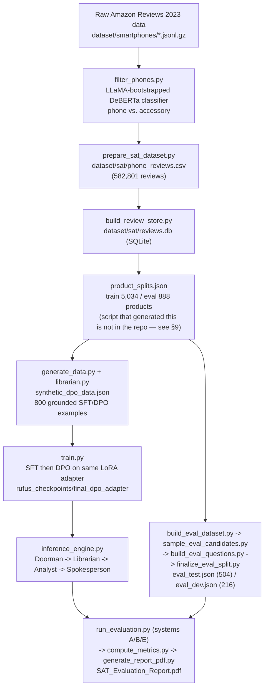

# SAT — Conversational AI for E-commerce Review Summarization

A conversational, evidence-grounded review-analysis system for the smartphone domain, built on **NousResearch/Meta-Llama-3-8B-Instruct** fine-tuned with **SFT + DPO**, wrapped in a four-layer inference pipeline (**Doorman → Librarian → Analyst → Spokesperson**) that retrieves real review sentences for a product and answers questions *only* from that evidence — abstaining when the evidence isn't there instead of guessing.

The project has been measured end-to-end: on questions verified to have zero relevant evidence, the full pipeline hallucinates **30.4%** of the time, versus **42.9%** for a vanilla-RAG baseline and **50.0%** for the LLM with no retrieval at all (same underlying weights in all three; see [§18 Evaluation](#18-evaluation) and [`SAT_Evaluation_Report.pdf`](SAT_Evaluation_Report.pdf)).

> **Read this before running anything.** This repository, as cloned, contains **code, evaluation datasets, and evaluation results — not the raw Amazon data, not the trained model weights, and not the intermediate caches.** Those are all listed in `.gitignore` because of their size (the full local working tree, including them, is ~15 GB). Reproducing the project from a clone means re-running the pipeline stages below in order. Every claim in this README was checked against the actual repository content on **2026-08-30**; where something could not be verified (a missing script, an incomplete dependency list), it is called out explicitly rather than guessed.

---

## Table of Contents

1. [Project Overview](#1-project-overview)
2. [Repository Structure](#2-repository-structure)
3. [Prerequisites](#3-prerequisites)
4. [Clone the Repository](#4-clone-the-repository)
5. [Environment Setup](#5-environment-setup)
6. [Dataset: Source, Download, and Placement](#6-dataset-source-download-and-placement)
7. [Pipeline Stage 1 — Combined ETL Dataset](#7-pipeline-stage-1--combined-etl-dataset-already-built)
8. [Pipeline Stage 2 — Phone vs. Accessory Filtering](#8-pipeline-stage-2--phone-vs-accessory-filtering)
9. [Pipeline Stage 3 — Review Store + Train/Eval Split](#9-pipeline-stage-3--review-store--traineval-split)
10. [Pipeline Stage 4 — Synthetic SFT/DPO Data Generation](#10-pipeline-stage-4--synthetic-sftdpo-data-generation)
11. [Pipeline Stage 5 — Training (SFT + DPO)](#11-pipeline-stage-5--training-sft--dpo)
12. [Pipeline Stage 6 — Running the Assistant Interactively](#12-pipeline-stage-6--running-the-assistant-interactively)
13. [The Librarian (Retrieval Module)](#13-the-librarian-retrieval-module)
14. [Evaluation Dataset: Construction](#14-evaluation-dataset-construction)
15. [Running the Full System Evaluation](#15-running-the-full-system-evaluation)
16. [Recommended End-to-End Path](#16-recommended-end-to-end-path)
17. [Supporting / One-Off Scripts](#17-supporting--one-off-scripts)
18. [Evaluation Results](#18-evaluation-results)
19. [Known Limitations and Open Bugs](#19-known-limitations-and-open-bugs)
20. [Troubleshooting](#20-troubleshooting)
21. [Reproducibility](#21-reproducibility)
22. [Git Usage](#22-git-usage)

---

## 1. Project Overview

**Problem.** A shopper asking "does this phone have a good camera?" wants an answer grounded in what real buyers actually said — not a generic spec-sheet guess, and not a confident answer to a question the reviews never address.

**What this project does.** Given a smartphone product and a natural-language question, the system:
1. Parses intent, the aspect being asked about, and persona (Doorman).
2. Retrieves and prunes the most relevant review sentences for that product/aspect (Librarian).
3. Structures the retrieved evidence into positive/negative/neutral buckets and flags contradictions (Analyst).
4. Generates an answer constrained to that evidence, or explicitly abstains if there isn't enough of it (Spokesperson — the SFT+DPO fine-tuned model).

**High-level workflow (verified against the actual scripts, not assumed):**



A separate, earlier-stage artifact — `dataset/combined_dataset` (82,958 rows, multi-domain ETL output; see [§7](#7-pipeline-stage-1--combined-etl-dataset-already-built)) — exists in the working tree but is **not** consumed by the phone-specific pipeline above; the phone pipeline reads directly from `dataset/smartphones/*.jsonl.gz`. This is documented rather than papered over, since the two are easy to conflate.

---

## 2. Repository Structure

Generated from `git ls-files` on the `eval-pipeline-and-report` branch, plus the untracked local artifacts that exist in this working tree (marked *[local only, gitignored]* — these will NOT be present after a fresh clone):

```text
SAT/
│
├── README.md                          this file
├── PROJECT_NOTES.md                   running log of validated state, known limitations
├── SAT_Evaluation_Report.pdf          20-page evaluation report (tracked, delivered)
├── requirements.txt                   core dependencies (INCOMPLETE — see §5)
├── .gitignore
│
├── dataset/                           [local only, gitignored]
│   ├── smartphones/                   raw Amazon "Cell Phones & Accessories" dump
│   │   ├── meta.jsonl.gz / reviews.jsonl.gz                 (raw, pre-filter)
│   │   └── meta_phones_only.jsonl.gz / reviews_phones_only.jsonl.gz  (filter_phones.py output)
│   ├── combined_dataset/              multi-domain ETL output, 82,958 rows (build_combined_dataset.py)
│   └── sat/
│       ├── phone_reviews.csv          582,801 rows (prepare_sat_dataset.py)
│       ├── reviews.db                 SQLite store, indexed on parent_asin (build_review_store.py)
│       ├── product_splits.json        train/eval product split (5,034 / 888, seed 42)
│       └── excluded_non_phone_asins.json
│
├── deberta_mini_phone_classifier/     [local only] trained phone/accessory classifier
├── rufus_checkpoints/                 [local only] SFT + DPO LoRA adapters
│   ├── sft_final/
│   └── final_dpo_adapter/             the adapter inference_engine.py actually loads
├── cache_librarian/                   [local only] per-product retrieval cache (.pkl, 1,132 files)
├── results/                           [local only] a Hugging Face Trainer output dir from an earlier
│                                       classifier run (checkpoint-480/) — not required by any documented step
├── labeled_bootstrap.json             [local only] cached LLaMA bootstrap labels for filter_phones.py
│
├── blair.py                           EARLY/SUPERSEDED whole-review BLAIR+FAISS retrieval prototype
│                                       (not imported anywhere — kept for history; see §13)
├── build_combined_dataset.py          Stage 1 ETL: multi-domain raw -> dataset/combined_dataset
├── filter_phones.py                   Stage 2: LLaMA bootstrap -> DeBERTa classifier -> phone-only filter
├── phone_filter.py                    deterministic residual non-phone filter (module; see §8)
├── prepare_sat_dataset.py             Stage 3: join phone-only meta+reviews -> phone_reviews.csv
├── build_review_store.py              Stage 3: phone_reviews.csv -> reviews.db (SQLite)
├── librarian.py                       production retrieval module (BM25 / BLAIR / hybrid, sentence-level)
├── generate_data.py                   Stage 4: grounded synthetic SFT/DPO data generator
├── regenerate_rejected.py             one-off patch script (see §17)
├── train.py                           Stage 5: SFT then DPO training (trl)
├── inference_engine.py                Stage 6: SATAgent — Doorman/Librarian/Analyst/Spokesperson, interactive CLI
├── run_pipeline.sh                    convenience script: pip install -> generate_data.py -> train.py
│
├── eval_lexicon.py                    keyword lexicons used to build ground truth (independent of retrieval)
├── build_eval_dataset.py              eval Pass 1: deterministic candidate selection
├── sample_eval_candidates.py          eval Pass 1.5: diversity-quota sampling -> eval_selected.json
├── build_eval_questions.py            eval Pass 2: LLM phrases question text only
├── patch_mismatched_eval_queries.py   one-off patch for a brand-leakage bug (see §14)
├── finalize_eval_split.py             normalizes schema, splits eval_dataset.json -> dev/test
├── eval_dataset.json / eval_dev.json / eval_test.json   720 / 216 / 504 queries (tracked, frozen)
├── eval_selected.json                 intermediate Pass-1.5 output (tracked)
│
├── run_evaluation.py                  generates System A/B/E responses against eval_test.json
├── run_full_eval.sh                   convenience wrapper: runs A, then B, then E
├── run_full_eval.log                  log from the run that produced the current results
├── eval_results_A.json / _B.json / _E.json   per-system generated responses (tracked)
├── eval_metrics.py                    objective (non-LLM) classifiers: abstention, contradiction,
│                                       brand hallucination, fabricated citation, recall/precision@k
├── judge_grounding.py                 secondary LLM-judge check (found unreliable — see §18)
├── judge_grounding.log
├── judge_results.json                 judge output (tracked)
├── compute_metrics.py                 aggregates eval_results_*.json + judge_results.json -> metrics.json
├── metrics.json                       final numbers (tracked)
├── generate_report_pdf.py             builds SAT_Evaluation_Report.pdf from metrics.json
│
├── smoke_test_librarian.py            compute-safety smoke test for the Librarian, before full-corpus use
├── smoke_test_retrieval_compare.py    BM25 vs BLAIR vs hybrid comparison (diagnostic)
├── smoke_test_blair_investigate.py    follow-up on why BLAIR-dense underperformed (diagnostic)
├── smoke_test_inference_engine.py     non-interactive smoke test for the full SATAgent pipeline
│
└── prepare_sat_dataset.py             (listed above under Stage 3)
```

| Category | What's in it |
|---|---|
| Source code | `librarian.py`, `inference_engine.py`, `train.py`, `phone_filter.py`, `eval_metrics.py`, `eval_lexicon.py` |
| Pipeline/ETL scripts | `build_combined_dataset.py`, `filter_phones.py`, `prepare_sat_dataset.py`, `build_review_store.py`, `generate_data.py` |
| Evaluation scripts | `build_eval_dataset.py`, `sample_eval_candidates.py`, `build_eval_questions.py`, `finalize_eval_split.py`, `run_evaluation.py`, `judge_grounding.py`, `compute_metrics.py`, `generate_report_pdf.py` |
| Configuration | `requirements.txt`, `.gitignore` |
| Datasets (tracked) | `eval_dataset.json`, `eval_dev.json`, `eval_test.json`, `eval_selected.json` |
| Datasets (local only, regenerate) | everything under `dataset/` |
| Trained models (local only, regenerate) | `rufus_checkpoints/`, `deberta_mini_phone_classifier/` |
| Outputs/results (tracked) | `eval_results_*.json`, `judge_results.json`, `metrics.json`, `SAT_Evaluation_Report.pdf` |
| Logs | `run_full_eval.log`, `judge_grounding.log` |
| One-off/patch scripts | `regenerate_rejected.py`, `patch_mismatched_eval_queries.py` |
| Diagnostic/smoke tests | `smoke_test_*.py` |
| Documentation | `README.md`, `PROJECT_NOTES.md` |

---

## 3. Prerequisites

Verified against the actual working environment used to build and evaluate this project (`.venv`, checked directly — not assumed):

| Requirement | Value | Notes |
|---|---|---|
| OS | Linux | Developed and evaluated on Linux (Ubuntu-based, kernel 7.0). No Windows/macOS-specific code, but untested there. |
| Python | **3.12.3** | The project's `.venv` runs this exact version. |
| GPU | **Required in practice**, not optional | Every stage that touches Llama-3-8B (bootstrap labeling, synthetic data generation, training, inference, evaluation) loads it in 4-bit via `bitsandbytes`, which needs CUDA. CPU-only execution is not tested and would be extremely slow for an 8B model even at 4-bit. |
| GPU used for this project | NVIDIA A30, 24 GB VRAM | Confirmed via `nvidia-smi` on the development machine. 24 GB is comfortable for 4-bit 8B + LoRA; less VRAM (e.g. 12–16 GB) may still work but was not tested here. |
| CUDA toolkit | 13.0 (`nvcc` on dev machine) | Match to your installed PyTorch build's supported CUDA version. |
| Disk space | **~15 GB** minimum for the full local working tree (raw+filtered datasets ~4.3 GB, `.venv` ~5.8 GB, checkpoints ~1.5 GB combined, librarian cache ~2.4 GB) — budget more headroom for the initial raw Amazon download before filtering shrinks it. |
| RAM | Not benchmarked in this session; the ETL and CSV/SQLite stages process data in streaming/batched fashion (not loaded fully into memory), so system RAM is unlikely to be the bottleneck versus VRAM. |
| Git | Any recent version | Standard clone/branch/push usage; see [§22](#22-git-usage). |
| Conda/venv | `venv` (via Python's built-in `venv` module) | This project's actual environment is a plain `.venv/`, not Conda. |
| API keys | **None required** | All models (Llama-3-8B-Instruct, BLAIR-RoBERTa, DeBERTa-v3-small) are pulled from Hugging Face Hub by model ID at first run and cached locally — no paid API calls anywhere in the pipeline. `NousResearch/Meta-Llama-3-8B-Instruct` is a gated-free mirror; if Hugging Face prompts for authentication on first download, run `huggingface-cli login` with a free HF account token. |

---

## 4. Clone the Repository

The actual configured remote (verified via `git remote -v`):

```bash
git clone https://github.com/Itzklp/SAT.git
cd SAT
```

The work described in this README lives on the **`eval-pipeline-and-report`** branch, not yet merged to `main`. After cloning:

```bash
git checkout eval-pipeline-and-report
```

(`main` currently has an earlier, smaller subset of the pipeline — 10 tracked files versus 44 on this branch before this README is added. See [§22](#22-git-usage).)

---

## 5. Environment Setup

```bash
python3 -m venv .venv
```

Activate it:

```bash
# Linux/macOS
source .venv/bin/activate

# Windows (cmd)
.venv\Scripts\activate.bat

# Windows (PowerShell)
.venv\Scripts\Activate.ps1
```

Install dependencies:

```bash
pip install -r requirements.txt
```

**`requirements.txt` is incomplete — verified by cross-checking every `import` statement in the repository's `.py` files against it.** It lists `torch`, `transformers`, `datasets`, `peft`, `trl`, `bitsandbytes`, `accelerate`, `scipy`, `pandas`, but the code also imports `matplotlib`, `rank_bm25` (as `rank-bm25` on PyPI), `spacy`, `faiss` (as `faiss-cpu`), `scikit-learn`, `tqdm`, and `numpy`. Rather than silently editing `requirements.txt` (this README's job is documentation, not changing project files), install the rest explicitly:

```bash
pip install matplotlib rank-bm25 spacy faiss-cpu scikit-learn tqdm numpy
python -m spacy download en_core_web_sm
```

Exact versions confirmed working in this project's own `.venv` (from `pip freeze`), if you want to pin instead of taking latest:

```text
torch==2.13.0
transformers==5.15.1
datasets==5.0.1
peft==0.20.0
trl==1.10.0
bitsandbytes==0.50.1
accelerate==1.14.0
scipy==1.18.1
pandas==3.0.5
numpy==2.5.2
matplotlib==3.11.1
rank-bm25==0.2.2
spacy==3.8.16
faiss-cpu==1.15.0
scikit-learn==1.9.0
```

> **Note:** these were installed against Python 3.12 with a CUDA 13.0 driver; on a different CUDA version you may need a different `torch`/`bitsandbytes` build. Check `nvidia-smi` and install the matching PyTorch wheel per [pytorch.org](https://pytorch.org/get-started/locally/) if the pinned version above doesn't have a compatible CUDA build for your driver.

---

## 6. Dataset: Source, Download, and Placement

**Where the raw data comes from.** The pipeline reads `dataset/smartphones/meta.jsonl.gz` and `dataset/smartphones/reviews.jsonl.gz`. No config file, README, or script comment in this repository names the exact source explicitly — this is a real gap in the current documentation, now flagged rather than silently worked around. However, the field schema is an exact, distinctive match (`parent_asin`, `main_category`, `average_rating`, `rating_number`, `features`, `description`, `price`, `images` with `thumb`/`large`/`variant`/`hi_res` for metadata; `parent_asin`, `title`, `text`, `rating`, `verified_purchase`, `timestamp`, `user_id`, `helpful_vote` for reviews) for the **McAuley-Lab "Amazon Reviews 2023"** dataset, category `Cell_Phones_and_Accessories`, hosted on Hugging Face:

- **Dataset**: [`McAuley-Lab/Amazon-Reviews-2023`](https://huggingface.co/datasets/McAuley-Lab/Amazon-Reviews-2023)
- **Configs needed**: `raw_review_Cell_Phones_and_Accessories` and `raw_meta_Cell_Phones_and_Accessories`

**Confirm this yourself before trusting it** — it is inferred from the data's shape, not read from an explicit source declaration in the repo. If you have access to whoever ran the original download, verify against them first.

No authentication is required for this dataset on Hugging Face; a standard `datasets` library load works:

```python
from datasets import load_dataset
meta = load_dataset("McAuley-Lab/Amazon-Reviews-2023", "raw_meta_Cell_Phones_and_Accessories", split="full", trust_remote_code=True)
reviews = load_dataset("McAuley-Lab/Amazon-Reviews-2023", "raw_review_Cell_Phones_and_Accessories", split="full", trust_remote_code=True)
```

Then export each to gzip-compressed JSON Lines matching what `build_combined_dataset.py`/`filter_phones.py` expect:

```python
import gzip, json
with gzip.open("dataset/smartphones/meta.jsonl.gz", "wt") as f:
    for row in meta:
        f.write(json.dumps(row) + "\n")
with gzip.open("dataset/smartphones/reviews.jsonl.gz", "wt") as f:
    for row in reviews:
        f.write(json.dumps(row) + "\n")
```

**Required files and where they go:**

```text
dataset/
└── smartphones/
    ├── meta.jsonl.gz        <- required, raw product metadata (place here first)
    └── reviews.jsonl.gz     <- required, raw reviews (place here first)
```

No renaming needed beyond matching these exact filenames — `filter_phones.py` and `build_combined_dataset.py` hardcode these paths. No manual extraction is needed; both scripts read `.jsonl.gz` directly via `gzip.open`.

Everything else under `dataset/` (`meta_phones_only.jsonl.gz`, `reviews_phones_only.jsonl.gz`, `combined_dataset/`, `sat/phone_reviews.csv`, `sat/reviews.db`, `sat/product_splits.json`) is **generated by running the pipeline stages below** — do not download or hand-place those.

If `build_combined_dataset.py`'s multi-domain ETL is also wanted (producing `dataset/combined_dataset`, 82,958 rows — a separate artifact from the phone-only pipeline, see [§7](#7-pipeline-stage-1--combined-etl-dataset-already-built)), place additional domains as sibling directories under `dataset/`, each with its own `meta.jsonl.gz`/`reviews.jsonl.gz`, following the same McAuley-Lab per-category config pattern (e.g. a `laptops` domain would use that dataset's laptop category). This project only actually built the `smartphones` domain — the multi-domain capability exists in code but wasn't otherwise exercised here.

---

## 7. Pipeline Stage 1 — Combined ETL Dataset (already built)

**Purpose**: cross-domain sampling/join/cap ETL over any `dataset/<domain>/` directories present, independent of the phone-specific pipeline.

**Input**: `dataset/<domain>/meta.jsonl.gz` + `reviews.jsonl.gz` for each domain subdirectory found.
**Output**: `dataset/combined_dataset` (a Hugging Face `Dataset` saved via `save_to_disk`).
**Script**: `build_combined_dataset.py`
**Command**:

```bash
python build_combined_dataset.py
```

**Verified current output** (loaded directly via `datasets.load_from_disk` on this repository's local copy): **82,958 rows**, columns `parent_asin, review_title, review_text, review_rating, verified_purchase, domain, product_title, main_category, average_rating, rating_number, price`. This matches the number given in the original project brief exactly. Only `domain == "smartphones"` is present in the current build (10,000-product cap per domain, ≤100 verified-purchase reviews per product, seed 42).

This dataset is **not** an input to any later phone-specific stage — it exists as a standalone multi-domain artifact. If you don't need it, you can skip this stage.

---

## 8. Pipeline Stage 2 — Phone vs. Accessory Filtering

Two filters are applied, in sequence, neither redoing the other's job:

### 8a. Model-based filter (`filter_phones.py`)

**Purpose**: separate true smartphone listings from accessories (cases, chargers, etc.) in the raw `smartphones` domain, using a small classifier trained on LLM-bootstrapped labels (cheaper than running the 8B model over the whole catalog).

**Pipeline inside this one script**:
1. LLaMA-3-8B-Instruct (4-bit) few-shot-classifies 5,000 sampled product titles as `phone`/`accessory` → cached to `labeled_bootstrap.json` (reused on subsequent runs unless `FORCE_REFRESH_BOOTSTRAP = True` is set in the script).
2. Those labels train a `microsoft/deberta-v3-small` sequence classifier (balanced classes, 80/20 split, 3 epochs) → saved to `deberta_mini_phone_classifier/` (reused if that directory already exists — the script skips retraining).
3. The trained classifier runs over the full `meta.jsonl.gz`, keeping only confident (`score > 0.60`) phone predictions that don't also match an accessory-keyword regex → `meta_phones_only.jsonl.gz` and the correspondingly filtered `reviews_phones_only.jsonl.gz`.

**Input**: `dataset/smartphones/meta.jsonl.gz`, `dataset/smartphones/reviews.jsonl.gz`
**Output**: `dataset/smartphones/meta_phones_only.jsonl.gz`, `dataset/smartphones/reviews_phones_only.jsonl.gz`
**Command**:

```bash
python filter_phones.py
```

Validated result (per `PROJECT_NOTES.md`): ~0.99 F1 on the held-out classifier validation split.

### 8b. Deterministic residual filter (`phone_filter.py`)

**Purpose**: a rule-based patch catching non-phone products that leaked past the classifier above (SIM cards, power banks, tablets, protection plans) — ~4.28% of the catalog (600/14,003 products) on inspection. This is a library module (`is_non_phone()`), not a standalone script.

**Important, honestly flagged gap**: no script currently tracked in this repository calls `phone_filter.is_non_phone()` — it is not imported by any `.py` file in the repo (verified via `grep`). The output it's meant to produce, `dataset/sat/excluded_non_phone_asins.json` (600 excluded ASINs), exists in the local working tree and is referenced by `dataset/sat/product_splits.json`, but the script that ran `phone_filter.py` over the catalog and wrote that file is not present. **If you need to regenerate `excluded_non_phone_asins.json` from scratch**, you'll need to write a short driver script that imports `is_non_phone` from `phone_filter.py`, applies it to the product titles in `phone_reviews.csv` (see Stage 3 below), and writes the excluded ASIN list — the filtering *logic* is fully present and documented in the module's own docstring, only the driver invocation is missing from version control.

---

## 9. Pipeline Stage 3 — Review Store + Train/Eval Split

### 9a. Join phone-only data into one CSV (`prepare_sat_dataset.py`)

**Input**: `dataset/smartphones/meta_phones_only.jsonl.gz`, `dataset/smartphones/reviews_phones_only.jsonl.gz`
**Output**: `dataset/sat/phone_reviews.csv`
**Command**:

```bash
python prepare_sat_dataset.py
```

Verified current output: **582,801 data rows** (`wc -l` minus header), columns `parent_asin, product_title, brand, model_name, price, average_rating, rating_number, screen_size, os, storage, wireless_carrier, cellular_technology, features, store, review_title, review_text, rating, verified_purchase, helpful_vote, timestamp, user_id`.

### 9b. Build the SQLite review store (`build_review_store.py`)

**Purpose**: fast per-product review lookup for the Librarian, instead of scanning a ~640 MB CSV on every query.

**Input**: `dataset/sat/phone_reviews.csv`
**Output**: `dataset/sat/reviews.db` (table `reviews`, indexed on `parent_asin`)
**Command**:

```bash
python build_review_store.py
```

Safe to re-run — it drops and rebuilds the table each time.

### 9c. Train/eval product split (`dataset/sat/product_splits.json`)

**Not reproducible from a tracked script in this repo** — same honestly-flagged gap as §8b: no committed script builds this file, but the file itself is present locally and its contents are internally consistent with everything documented in `PROJECT_NOTES.md`: 5,034 train products / 888 eval products, `seed: 42`, `min_reviews: 10`, referencing `excluded_non_phone_asins_file: dataset/sat/excluded_non_phone_asins.json`. Every downstream script (`generate_data.py`, `build_eval_dataset.py`, `smoke_test_inference_engine.py`) reads this file directly and assumes it exists with `train_asins`/`eval_asins` keys.

If this file is missing and you need to regenerate it: apply `phone_filter.is_non_phone()` to exclude residual non-phones, count reviews per remaining `parent_asin` in `reviews.db`, drop products under 10 reviews, then split the remainder into train/eval with `random.seed(42)` to reproduce the same proportions (5,034/888 ≈ 85%/15% of eligible products).

---

## 10. Pipeline Stage 4 — Synthetic SFT/DPO Data Generation

**Purpose**: generate grounded question/answer training pairs — a "chosen" answer written with real retrieved review evidence in context (or a templated abstention if too little evidence exists), and a "rejected" answer from the same model given the same question but **no** evidence access (a realistic, principled contrastive negative rather than an instructed "write a bad answer").

**Input**: `dataset/sat/product_splits.json` (TRAIN split only — eval products are never touched here, keeping the eval set genuinely held out), `dataset/sat/reviews.db` via `librarian.py`.
**Output**: `synthetic_dpo_data.json`
**Script**: `generate_data.py`
**Commands**:

```bash
# smoke test first — always do this before the full run
python generate_data.py --n 20 --out smoke_test_data.json

# full run (what actually produced the current synthetic_dpo_data.json)
python generate_data.py --n 800 --out synthetic_dpo_data.json

# to resume an interrupted full run (checkpoints after every batch):
python generate_data.py --n 800 --out synthetic_dpo_data.json --resume
```

Flags (from the script's own `argparse`): `--n` (count, default 20), `--out` (output path), `--seed` (default 0), `--resume` (continue from an existing `--out` file).

Verified current output: **800 examples** (512 `grounded_aspect`, 288 `abstention`), audited per `PROJECT_NOTES.md` as 0 leakage into eval products, 0 contamination, 0 duplicates.

A known, already-fixed data-quality bug from earlier in the project: the "rejected" side was truncated mid-sentence in 95% of examples due to a missing length constraint. This is what `regenerate_rejected.py` patched (see [§17](#17-supporting--one-off-scripts)) — not something you need to redo if regenerating from a clean run of the current `generate_data.py`, since the length-matching fix is already in the script.

---

## 11. Pipeline Stage 5 — Training (SFT + DPO)

**Model**: `NousResearch/Meta-Llama-3-8B-Instruct`, loaded 4-bit (`nf4`, double-quant, `bfloat16` compute dtype) via `bitsandbytes`.
**Method**: LoRA (r=16, alpha=32, dropout=0.05, targeting `q/k/v/o_proj` + `gate/up/down_proj`) — SFT first, then DPO **continuing the same adapter** (not a fresh one).
**Input**: `synthetic_dpo_data.json`
**Output**: `rufus_checkpoints/sft_final/` (SFT adapter), `rufus_checkpoints/final_dpo_adapter/` (final DPO adapter — this is what `inference_engine.py` actually loads).
**Script**: `train.py`

```bash
# smoke test on a tiny slice first
python train.py --data_file synthetic_dpo_data.json --max_examples 20

# full run, both stages
python train.py --data_file synthetic_dpo_data.json

# or run stages independently
python train.py --sft_only
python train.py --dpo_only
```

Flags (from `train.py`'s `argparse`): `--data_file` (default `synthetic_dpo_data.json`), `--max_examples` (slice for smoke testing), `--sft_only`, `--dpo_only`, `--output_dir` (default `./rufus_checkpoints`).

Training config actually used (1 epoch each): SFT lr=2e-4, batch 8 × grad-accum 2; DPO lr=5e-6, batch 2 × grad-accum 8, beta=0.1. **Verified training outcome** (from `PROJECT_NOTES.md`, cross-referenced against `rufus_checkpoints/dpo/checkpoint-50/trainer_state.json`): DPO loss dropped 0.616 → 0.199, reward accuracy reached 1.0, reward margin grew to 1.56, over 50 steps on 800 examples. Hardware: single NVIDIA A30 (24 GB) — expect training time to scale accordingly on smaller GPUs (may need to reduce batch size / increase grad-accum).

A convenience wrapper exists for the install → generate → train sequence:

```bash
bash run_pipeline.sh
```

(equivalent to `pip install -r requirements.txt` (incomplete — see [§5](#5-environment-setup)) → `python generate_data.py` (uses script defaults, not the 800-example full run — check the printed `--n` before trusting the output) → `python train.py`.)

---

## 12. Pipeline Stage 6 — Running the Assistant Interactively

**Script**: `inference_engine.py` — loads the base model, attaches `rufus_checkpoints/final_dpo_adapter` if present, loads BLAIR-RoBERTa and spaCy once and shares them into the `Librarian`.

```bash
python inference_engine.py
```

Interactive commands, exactly as implemented in the script's `__main__` loop:

```text
persona <1-5>          set persona: 1=Photographer 2=Student 3=Gamer 4=Traveler 5=Developer
product <search term>  search the catalog by keyword, then pick a numbered match
<any other text>       ask a question about the currently selected product
exit                   quit
```

You must `product <search term>` and pick a product before asking a question — the agent needs a selected `parent_asin` to retrieve evidence for.

---

## 13. The Librarian (Retrieval Module)

`librarian.py`'s `Librarian` class is the production retrieval component, used by both `generate_data.py` and `inference_engine.py`. It builds a per-product cache (`cache_librarian/<parent_asin>.pkl`) on first access to that product and reuses it after.

```python
from librarian import Librarian
lib = Librarian()  # or Librarian(encode_fn=..., nlp=...) to share an already-loaded BLAIR model/spaCy pipeline
sentences, scores = lib.retrieve_and_prune(parent_asin, query, top_k=10, mode="hybrid", min_score=None)
```

`mode` is one of `"bm25"`, `"blair"`, `"hybrid"` — retrieval operates at **sentence granularity** (spaCy-split), not whole-review granularity. This was a deliberate design choice after diagnostic smoke testing (`smoke_test_retrieval_compare.py`, `smoke_test_blair_investigate.py`) found whole-review BLAIR embeddings diluted a relevant sentence buried in an otherwise off-topic review — this is also why `blair.py` (the original whole-review prototype) is superseded and unused.

**Known, documented limitation** (see `PROJECT_NOTES.md` and [§19](#19-known-limitations-and-open-bugs)): the `min_score` sufficiency gate compares against a per-query min-max-normalized score, which is *relative*, not *absolute* — the top candidate for any query is always stretched toward 1.0 even if nothing in the pool is actually relevant. This has been empirically confirmed to occasionally pass irrelevant evidence as "sufficient." The system still behaves safely in practice today because the Spokesperson reads evidence content, not just the count/score — but this is a redundant safety net, not a substitute for a correctly calibrated gate. A fix is scoped but not yet implemented: switch to raw (non-normalized) cosine similarity with a threshold calibrated against `eval_dev.json`.

---

## 14. Evaluation Dataset: Construction

720 queries (`eval_dataset.json`), split 30/70 into `eval_dev.json` (216, for calibration) and `eval_test.json` (504, **frozen** — never touch for threshold-tuning), stratified by category, seed 99. Ground truth is built **independent of the system's own BLAIR/BM25 retrieval** (`eval_lexicon.py`'s keyword+rating logic) specifically to avoid evaluating the system against labels its own retrieval mechanism produced.

| Stage | Script | Purpose |
|---|---|---|
| 1 | `build_eval_dataset.py` | Deterministic keyword+rating candidate selection over eval-split products only, **no LLM** — produces the disposable intermediate `eval_candidates.json` (not tracked; regenerate if needed) |
| 1.5 | `sample_eval_candidates.py` | Diversity-aware quota sampling across 8 categories → `eval_selected.json` |
| 2 | `build_eval_questions.py` | LLM phrases the question **text only** — never influences gold labels. Auto-resumes from `--out_file` if it already exists. |
| — | `patch_mismatched_eval_queries.py` | One-off patch for a found bug: 23 questions in `unsupported_feature`/`multi_aspect`/`overall_suitability` invented specific brand names unprompted (28% of `unsupported_feature`). Already applied to the tracked `eval_dataset.json`. |
| 3 | `finalize_eval_split.py` | Schema normalization + stratified dev/test split |

Category counts (dev+test): `aspect_specific` (150), `persona_aware` (150), `contradiction` (100), `multi_aspect` (80), `overall_suitability` (80), `unsupported_aspect` (70), `unsupported_feature` (50), `ambiguous` (40).

To regenerate from scratch:

```bash
python build_eval_dataset.py
python sample_eval_candidates.py
python build_eval_questions.py --limit 10   # smoke test first
python build_eval_questions.py              # full run, auto-resumes if interrupted
python patch_mismatched_eval_queries.py     # only needed if you hit the same brand-leakage bug
python finalize_eval_split.py
```

The tracked `eval_dataset.json`/`eval_dev.json`/`eval_test.json` in this repository already reflect the patched, finalized state — you do **not** need to run this section again unless you're rebuilding the eval set from different source products.

---

## 15. Running the Full System Evaluation

Three systems, same underlying DPO-tuned weights, so the comparison isolates architecture rather than model tuning:

- **A**: LLM-only, no retrieval at all.
- **B**: vanilla RAG — unfiltered BLAIR-dense top-8 retrieval, no Doorman/Analyst/abstention gate.
- **E**: full pipeline — Doorman → Librarian → Analyst → Spokesperson.

```bash
# per-system, so a crash in one doesn't lose the others (each checkpoints per-batch)
python run_evaluation.py --system A --eval_file eval_test.json
python run_evaluation.py --system B --eval_file eval_test.json
python run_evaluation.py --system E --eval_file eval_test.json

# or, all three in sequence:
bash run_full_eval.sh

# smoke test any of the above first with --limit
python run_evaluation.py --system E --eval_file eval_test.json --limit 10
```

Then the secondary LLM-judge check (same base model, adapter disabled — a disclosed limitation, see [§18](#18-evaluation-results)) and metrics aggregation:

```bash
python judge_grounding.py         # reads eval_results_B.json / eval_results_E.json, writes judge_results.json
python compute_metrics.py         # aggregates everything -> metrics.json
python generate_report_pdf.py     # metrics.json -> SAT_Evaluation_Report.pdf
```

`judge_grounding.py` and `compute_metrics.py` take no required arguments; both read fixed filenames in the current directory. `generate_report_pdf.py` likewise reads `metrics.json` and writes `SAT_Evaluation_Report.pdf` in place.

---

## 16. Recommended End-to-End Path

| Step | Command | Output |
|---|---|---|
| 1. Clone | `git clone https://github.com/Itzklp/SAT.git && cd SAT && git checkout eval-pipeline-and-report` | repo on disk |
| 2. Environment | `python3 -m venv .venv && source .venv/bin/activate` | `.venv/` |
| 3. Dependencies | `pip install -r requirements.txt` + the extra packages in [§5](#5-environment-setup) + `python -m spacy download en_core_web_sm` | installed packages |
| 4. Download raw data | see [§6](#6-dataset-source-download-and-placement) | `dataset/smartphones/meta.jsonl.gz`, `reviews.jsonl.gz` |
| 5. Filter phones | `python filter_phones.py` | `meta_phones_only.jsonl.gz`, `reviews_phones_only.jsonl.gz`, `deberta_mini_phone_classifier/` |
| 6. Join to CSV | `python prepare_sat_dataset.py` | `dataset/sat/phone_reviews.csv` |
| 7. Build review store | `python build_review_store.py` | `dataset/sat/reviews.db` |
| 8. Train/eval split | *(see the honest gap in §9c — write/recover the driver script)* | `dataset/sat/product_splits.json` |
| 9. Generate training data | `python generate_data.py --n 20 --out smoke.json` then `python generate_data.py --n 800 --out synthetic_dpo_data.json` | `synthetic_dpo_data.json` |
| 10. Train | `python train.py --max_examples 20` (smoke) then `python train.py` | `rufus_checkpoints/final_dpo_adapter/` |
| 11. Try it manually | `python inference_engine.py` | interactive session |
| 12. Build eval set | *(only if not using the tracked `eval_test.json`)*, see [§14](#14-evaluation-dataset-construction) | `eval_test.json` |
| 13. Run evaluation | `bash run_full_eval.sh` | `eval_results_A/B/E.json` |
| 14. Judge + metrics | `python judge_grounding.py && python compute_metrics.py` | `judge_results.json`, `metrics.json` |
| 15. Report | `python generate_report_pdf.py` | `SAT_Evaluation_Report.pdf` |

If all you want is to **inspect the already-computed results** (no GPU, no dataset download needed), steps 1–3 plus reading the tracked `metrics.json` / `SAT_Evaluation_Report.pdf` / `PROJECT_NOTES.md` directly is sufficient — those are already in the repository.

---

## 17. Supporting / One-Off Scripts

These are not part of the numbered pipeline above — they were used once, to fix a specific found problem, and are kept for provenance/auditability rather than being part of a routine run:

| Script | What it did | When you'd need it |
|---|---|---|
| `regenerate_rejected.py` | Patched the "rejected" field of an existing `synthetic_dpo_data.json` in place (95% were truncated mid-sentence due to a missing length constraint in the original generation prompt). Keeps a backup of the original file. | Only if regenerating from an *old* `synthetic_dpo_data.json` produced before the fix was folded into `generate_data.py`. Not needed on a fresh `generate_data.py` run today. |
| `patch_mismatched_eval_queries.py` | Fixed 23 eval questions that had invented brand names unrelated to their actual gold product (a prompt bug in `build_eval_questions.py`, since fixed at the source). | Only if rebuilding the eval set from scratch with the pre-fix prompt; not needed against the current `build_eval_questions.py`. |
| `smoke_test_librarian.py` | Compute-safety validation of BLAIR-RoBERTa + FAISS + spaCy pruning on 2 real products, before running over the full 582,801-review corpus. | Re-run if you change the Librarian's retrieval internals and want a cheap sanity check before a full run. |
| `smoke_test_retrieval_compare.py` | Diagnostic: BM25 vs. BLAIR-dense vs. hybrid on the same product/query pairs — this is what led to choosing sentence-level, not whole-review, retrieval. | Reference only; not part of routine execution. |
| `smoke_test_blair_investigate.py` | Follow-up on why whole-review BLAIR underperformed BM25 (tested sentence-level indexing and mean- vs. CLS-pooling hypotheses). | Reference only. |
| `smoke_test_inference_engine.py` | Non-interactive smoke test of the full `SATAgent` pipeline against 4 sampled eval-split products before trusting manual interactive testing. | Re-run after any change to `inference_engine.py` as a fast regression check. |

---

## 18. Evaluation Results

Full detail, methodology, and page-by-page findings are in [`SAT_Evaluation_Report.pdf`](SAT_Evaluation_Report.pdf) (20 pages) and `metrics.json` (raw numbers). Summarized here, verified directly against the current `metrics.json` in this repository (not re-typed from memory):

**Core result — hallucination rate on questions with zero relevant evidence (verified independently of the system's own retrieval):**

| System | n scored | Hallucination rate |
|---|---|---|
| A: LLM-only | 84 | **50.0%** |
| B: Vanilla RAG | 84 | **42.9%** |
| E: Full SAT pipeline | 79 (5 excluded as Doorman CLARIFY, tracked separately) | **30.4%** |

**Other headline metrics** (`metrics.json`):
- System A fabricates a claimed "customer reviews" citation in **98.3%** of responses despite being given zero evidence.
- Retrieval quality (system E vs. B, mean Recall@k / Precision@k over 336 scoreable queries): E 0.490 / 0.492 vs. B 0.416 / 0.414 — E retrieves better evidence, not just gates on it.
- Context reduction from sentence-level pruning: ~98% (B) and ~97.9% (E) fewer sentences kept than candidates considered.
- Over-abstention on genuinely answerable questions: A 25.5%, B 28.3%, E 30.4% — flagged as worth investigating, not resolved.
- Contradiction acknowledgment (queries with verified conflicting evidence): B 72.9% vs. E 61.4% — **vanilla RAG acknowledged contradictions more often than the full pipeline**, a counter-intuitive result reported as-is rather than framed as a win for either side (this was corrected in the report after an initial draft mis-stated the direction — see [§19](#19-known-limitations-and-open-bugs)).
- Doorman CLARIFY-branch bug: 1.7% of non-ambiguous queries (8/476) incorrectly triggered a clarifying question instead of an answer, and 4 of those hallucinated an unrelated brand name inside the clarifying question itself.
- Doorman clarify recall on genuinely ambiguous queries: 89.3%.
- LLM-judge secondary check: **unreliable** — 30–36% JSON parse failures, near-zero discrimination among what parsed (B: 0.0% judged-hallucination on 70 sampled, E: 1.6% on 64 sampled) — reported honestly as a negative finding about same-model-family self-judging, not presented as a clean confirmation.

**Verdict**: the architecture measurably reduces hallucination versus both baselines on an objective, ground-truth-backed metric — not merely a judge's opinion — and the improvement specifically survives an apples-to-apples comparison against vanilla RAG (same retrieval, no gate), isolating the value of the Doorman/Analyst/abstention-gate additions. It is not a finished system: retrieval recall/precision (~49%) leaves real room to improve, over-abstention is somewhat high across all three systems, and the Doorman CLARIFY brand-hallucination bug is real and unfixed in code as of this writing.

---

## 19. Known Limitations and Open Bugs

Carried forward from `PROJECT_NOTES.md` — not hidden, not resolved just because they're documented:

1. **Retrieval sufficiency gate uses relative, not absolute, scores** (`librarian.py`) — see [§13](#13-the-librarian-retrieval-module). Deferred fix: raw cosine similarity, threshold calibrated against `eval_dev.json`.
2. **`phone_filter.py` residual gaps** — known false negatives on titles where an accessory keyword coincidentally follows a phone word in a real accessory listing (e.g. "Iridium Satellite Phone Global Prepaid SIM Card"). Accepted, not chased further.
3. **Doorman CLARIFY brand-hallucination bug** (~1.7% of queries) — tracked in `metrics.json`'s `doorman_false_clarify`, not yet fixed in `inference_engine.py`.
4. **Over-abstention** (26–30% across all three systems on answerable questions) — not yet root-caused as "genuine model conservatism" vs. "abstention-pattern classifier still too broad."
5. **`product_splits.json` and `excluded_non_phone_asins.json` generation scripts are not in version control** — see [§8b](#8b-deterministic-residual-filter-phone_filterpy) and [§9c](#9c-traineval-product-split-datasetsatproduct_splitsjson). The output files are present and internally consistent, but not reproducible from a tracked script today.
6. **`requirements.txt` is incomplete** — see [§5](#5-environment-setup). Not edited as part of this documentation pass per this task's own scope rule (README changes only); flagged here instead.
7. **Post-delivery correction on the evaluation report**: an earlier draft of `SAT_Evaluation_Report.pdf`'s Findings section claimed the Analyst's evidence structuring "appears to directly help" contradiction acknowledgment, when the underlying numbers actually showed the opposite (vanilla RAG 73% vs. full pipeline 61%). This was caught in a post-delivery re-check against `metrics.json`, fixed in `generate_report_pdf.py`'s synthesis logic, and the corrected PDF is what's in this repository now — noted here so the correction itself is part of the audit trail, not just silently fixed.
8. **`blair.py` is a superseded prototype**, not used by any current pipeline stage — kept only for history (see [§13](#13-the-librarian-retrieval-module)).
9. **`results/checkpoint-480/`** (a Hugging Face `Trainer` output directory, local-only) does not correspond to any documented, currently-used artifact — likely leftover from an earlier run of the DeBERTa classifier training before `filter_phones.py`'s `TrainingArguments(save_strategy="no")` was set. Not required by any command in this README.

---

## 20. Troubleshooting

### `FileNotFoundError: dataset/sat/product_splits.json` (or `reviews.db`, or `phone_reviews.csv`)
These are generated by pipeline stages, not shipped with the repo (all under `.gitignore`). Run the stages in order from [§8](#8-pipeline-stage-2--phone-vs-accessory-filtering) onward. If it's specifically `product_splits.json`, see the honestly-flagged gap in [§9c](#9c-traineval-product-split-datasetsatproduct_splitsjson) — there's no tracked script that regenerates it automatically.

### CUDA / GPU errors on model load (`bitsandbytes`, `torch.cuda`)
Every stage that loads Llama-3-8B needs a CUDA-capable GPU with 4-bit quantization support (`bitsandbytes`). Confirm `nvidia-smi` shows a GPU and `python -c "import torch; print(torch.cuda.is_available())"` prints `True`. If `bitsandbytes` fails to find a compatible CUDA build, reinstall matching your driver's CUDA version — see [pytorch.org](https://pytorch.org/get-started/locally/) and the [bitsandbytes install docs](https://github.com/bitsandbytes-foundation/bitsandbytes). There is no tested CPU fallback for the 8B model in this codebase.

### `ModuleNotFoundError` (matplotlib, rank_bm25, spacy, faiss, sklearn, tqdm)
`requirements.txt` doesn't list these — install them explicitly, see [§5](#5-environment-setup). For spaCy specifically, you additionally need `python -m spacy download en_core_web_sm` — a bare `pip install spacy` doesn't include the language model.

### Out-of-memory on GPU during training or evaluation
Training (`train.py`) and batched evaluation (`run_evaluation.py`, `BATCH_SIZE = 8`) assume ~24 GB VRAM (the A30 used for this project). On a smaller GPU: reduce `per_device_train_batch_size` / increase gradient accumulation in `train.py`, or lower `BATCH_SIZE` at the top of `run_evaluation.py` / `generate_data.py`. All three currently hardcode their batch sizes rather than exposing a CLI flag for it.

### `sqlite3.OperationalError: no such table: reviews`
`dataset/sat/reviews.db` either wasn't built yet or was built from an empty/wrong CSV. Re-run `python build_review_store.py` after confirming `dataset/sat/phone_reviews.csv` has content (`wc -l` should show ~582,802 including header).

### Hugging Face authentication prompt on first model download
`NousResearch/Meta-Llama-3-8B-Instruct` is not gated on the Hub, so this shouldn't normally happen — but if it does (org policy changes, rate limiting), run `huggingface-cli login` with a free Hugging Face account token.

### Path errors when running scripts from a different working directory
Every script in this repo uses relative paths (`dataset/sat/...`, `./rufus_checkpoints`, `cache_librarian/...`) assuming it's invoked **from the repository root**. Always `cd` into the repo root before running any command in this README.

---

## 21. Reproducibility

- **Product train/eval split**: seed 42, `dataset/sat/product_splits.json`, min 10 reviews/product, 5,034 train / 888 eval products after exclusions.
- **Synthetic data generation**: seed 0 by default in `generate_data.py`'s `--seed` flag (the actual 800-example run's exact seed value used isn't separately recorded beyond the script default — verify against your own run's logs if exact reproduction matters); hybrid retrieval, `MIN_SCORE=0.55`, `MIN_EVIDENCE_SENTENCES=3`; teacher model `NousResearch/Meta-Llama-3-8B-Instruct`.
- **SFT**: 1 epoch, LoRA r=16/alpha=32, lr=2e-4, batch 8 × grad-accum 2.
- **DPO**: 1 epoch, same LoRA continued (not a fresh adapter), lr=5e-6, batch 2 × grad-accum 8, beta=0.1.
- **Evaluation split**: seed 99, stratified 30/70 dev/test, 720 total queries.
- **Hardware**: single NVIDIA A30 (24 GB) for all training/evaluation runs referenced in this README's numbers. Results on different hardware should match algorithmically (nothing hardware-specific in the logic) but exact latency numbers in `metrics.json`'s `efficiency` section will not transfer.
- **Package versions**: pinned list in [§5](#5-environment-setup), taken directly from this project's own `.venv` via `pip freeze`.
- **Python version**: 3.12.3.

---

## 22. Git Usage

Standard workflow for contributing to this repository:

```bash
git status                          # see what's changed
git pull                            # get latest from the current branch's remote
git checkout -b <your-branch-name>  # branch before making changes — do not commit directly to main
# ... make your changes ...
git add <files>
git commit -m "meaningful message"
git push -u origin <your-branch-name>
```

Verified current state (as of this README):
- **Remote**: `origin` → `https://github.com/Itzklp/SAT.git`
- **`main`**: 10 tracked files — an earlier, smaller subset of the pipeline.
- **`eval-pipeline-and-report`**: 44 tracked files (45 including this README) — the full pipeline plus the evaluation dataset, results, and report described in this README. Not yet merged into `main`.

If you're picking this up fresh, branch off `eval-pipeline-and-report` (not `main`) to get the complete, current pipeline.
